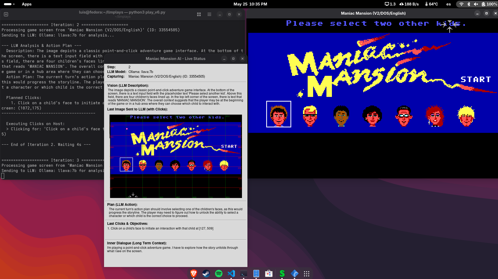

# Point-and-click adventure game AI Player

This project automates playing the classic point-and-click adventure game like "Maniac Mansion" or "Monkey Island" on  Linux using computer vision and AI. The script captures screenshots of the game window, sends them to a Large Language Model (LLM) for analysis, and executes the AI-suggested clicks to interact with the game.

## Features

-   **Automated Gameplay**: AI analyzes game screenshots and suggests actions as pixel coordinates for clicks.
-   **Flexible LLM Integration**:
    -   Supports local LLMs via Ollama (e.g., LLaVA, Gemma).
    -   Supports remote LLMs via OpenAI (e.g., GPT-4o, GPT-4 Turbo) and Anthropic (e.g., Claude 3 series).
-   **Dynamic Window Management**:
    -   Prompts user to select the target game window from a list of currently open windows.
    -   Uses `xdotool` for window detection and coordinate translation.
-   **Session Recording**: Saves screenshots and LLM analysis JSON for each iteration in a timestamped session directory under `sessions/`.
-   **Interactive Status Window**: Provides a live Tkinter-based GUI showing the current step, LLM being used, game window name, LLM's description, action plan, last clicks, the image sent to the LLM (with click overlays), and the long-term game context.
    -   *Example of the status window:*
        
-   **Configurable Context**: Allows setting a long-term strategic context for the LLM.
-   **Robust Error Handling**: Designed to handle various potential issues gracefully.

## System Requirements

-   **Operating System**: Fedora Linux (tested, other Linux distributions with X11 may work).
-   **Display Server**: X11.
-   **Game**: ScummVM running Maniac Mansion (or any game window you wish to target).
-   **LLM Setup**:
    -   **Local**: Ollama installed, running, and accessible, with vision-capable models pulled (e.g., `ollama pull llava`, `ollama pull gemma:7b`).
    -   **Remote**: Valid API keys for OpenAI and/or Anthropic if you intend to use their models.
-   **Python**: Python 3.8 or higher.
-   **System Tools**: `xdotool` and `xprop` (typically provided by `xorg-x11-utils` on Fedora). `python3-tkinter` for the GUI.

## Required Tools & Libraries

### Python Packages:
(See `requirements.txt`)
-   `ollama`: For interacting with local Ollama models.
-   `pyautogui`: For emulating mouse clicks.
-   `mss`: For capturing screenshots efficiently.
-   `Pillow`: For image processing (PIL).
-   `openai`: For interacting with OpenAI API.
-   `anthropic`: For interacting with Anthropic API.

### System Packages (Fedora):
(See `INSTALL.sh`)
-   `xdotool`: For window management and information.
-   `xorg-x11-utils`: Provides `xprop`, used for window information.
-   `python3-tkinter`: For the Tkinter GUI library used by the status window.

## Configuration

The main script (`play.py`) contains several configurable constants and placeholders at the top:

-   **API Keys**:
    -   `OPENAI_API_KEY`: Placeholder for your OpenAI API key.
    -   `ANTHROPIC_API_KEY`: Placeholder for your Anthropic API key.
    -   **IMPORTANT**: It is highly recommended to use environment variables or a secure configuration file to manage API keys rather than hardcoding them.
-   `DEFAULT_GAME_WINDOW_TITLE`: Default title to search for if automatic selection is skipped (e.g., "Maniac Mansion").
-   `SESSIONS_DIR`: Directory where session data (screenshots, LLM logs) will be saved.
-   `SCREENSHOT_INTERVAL`: Seconds to wait after an LLM response before taking the next screenshot.
-   `CLICK_INTERVAL`: Seconds to wait between multiple clicks from a single LLM response.
-   `INTERNAL_CROP`: Dictionary to define cropping from the edges of the captured window (e.g., to remove ScummVM borders).
    ```python
    INTERNAL_CROP = {"top": 0, "bottom": 0, "left": 0, "right": 0} # Adjust as needed
    ```
-   `LLM_GAME_CONTEXT`: A string defining the long-term strategy or context provided to the LLM.
    ```python
    LLM_GAME_CONTEXT = "I'm playing a point-and-click adventure game. I have to explore how the story unfolds through what I see on the screen."
    ```

## Installation

1.  **Clone the Repository**:
    ```bash
    git clone <repository-url>
    cd <repository-directory>
    ```

2.  **Install System Dependencies (Fedora)**:
    Run the provided installation script (or execute commands manually):
    ```bash
    chmod +x INSTALL.sh
    ./INSTALL.sh
    ```
    This will install `xdotool`, `xorg-x11-utils`, and `python3-tkinter`.

3.  **Set up Python Environment (Recommended)**:
    It's good practice to use a virtual environment:
    ```bash
    python3 -m venv .venv
    source .venv/bin/activate
    ```

4.  **Install Python Dependencies**:
    ```bash
    pip install -r requirements.txt
    ```

5.  **Configure Ollama (if using local LLMs)**:
    -   Ensure Ollama is installed and running: [Ollama Download](https://ollama.com/)
    -   Pull a vision-capable model:
        ```bash
        ollama pull llava
        # or other models like:
        # ollama pull gemma:7b (ensure it's a vision variant if available/needed)
        # ollama pull bakllava
        ```

6.  **Configure API Keys (if using remote LLMs)**:
    Edit `play_v6.py` to include your API keys or, preferably, set them as environment variables that the script can read.

## Usage

1.  **Activate Virtual Environment** (if you created one):
    ```bash
    source .venv/bin/activate
    ```

2.  **Run the Script**:
    ```bash
    python play.py
    ```

3.  **Follow On-Screen Prompts**:
    -   The script will first prompt you to select the target game window from a list of currently open windows.
    -   Then, it will prompt you to select an LLM model from the available local (Ollama) and configured remote (OpenAI, Anthropic) models.

4.  **Monitor**:
    -   The console will display iteration progress, LLM analysis, and planned/executed clicks.
    -   A separate "Maniac Mansion AI - Live Status" window will provide a real-time GUI overview.

5.  **To Stop**:
    -   Close the "Live Status" window.
    -   Or, press `Ctrl+C` in the terminal where the script is running.

## Session Data

-   Each run creates a new timestamped subdirectory within the `sessions/` folder (e.g., `sessions/session_20250526_103000`).
-   Inside each session directory:
    -   `iter_XXXX_shot_HHMMSS_MS.png`: Screenshots taken for each iteration, with a grid overlay if sent to the LLM.
    -   `iter_XXXX_llm_HHMMSS_MS.json`: The JSON response received from the LLM for that iteration.
    -   `play_session.log`: A log file containing detailed information, debug messages, and errors from the script's execution for that session.

## License

This project is licensed under the MIT License.

```
MIT License

Copyright (c) 2025 Luis Hernandez @luishg

Permission is hereby granted, free of charge, to any person obtaining a copy
of this software and associated documentation files (the "Software"), to deal
in the Software without restriction, including without limitation the rights
to use, copy, modify, merge, publish, distribute, sublicense, and/or sell
copies of the Software, and to permit persons to whom the Software is
furnished to do so, subject to the following conditions:

The above copyright notice and this permission notice shall be included in all
copies or substantial portions of the Software.

THE SOFTWARE IS PROVIDED "AS IS", WITHOUT WARRANTY OF ANY KIND, EXPRESS OR
IMPLIED, INCLUDING BUT NOT LIMITED TO THE WARRANTIES OF MERCHANTABILITY,
FITNESS FOR A PARTICULAR PURPOSE AND NONINFRINGEMENT. IN NO EVENT SHALL THE
AUTHORS OR COPYRIGHT HOLDERS BE LIABLE FOR ANY CLAIM, DAMAGES OR OTHER
LIABILITY, WHETHER IN AN ACTION OF CONTRACT, TORT OR OTHERWISE, ARISING FROM,
OUT OF OR IN CONNECTION WITH THE SOFTWARE OR THE USE OR OTHER DEALINGS IN THE
SOFTWARE.
```